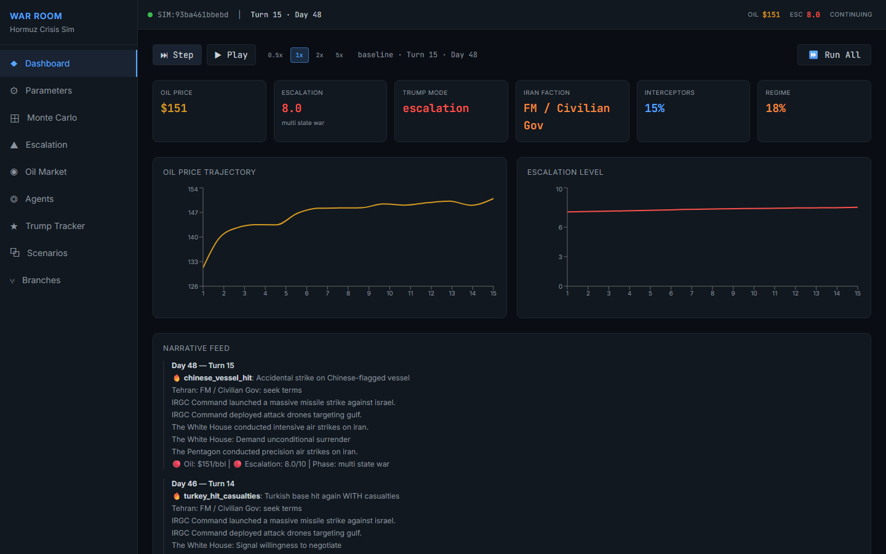
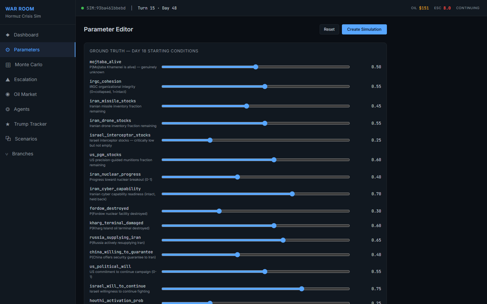
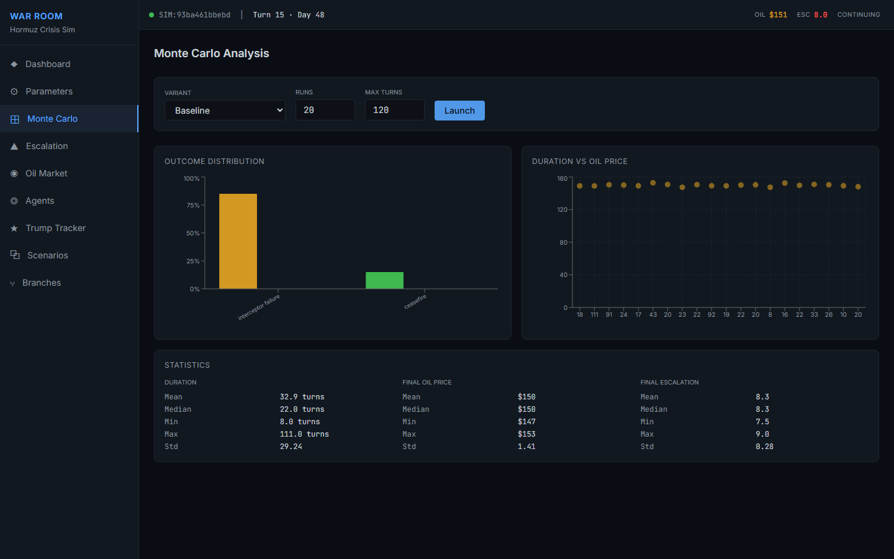
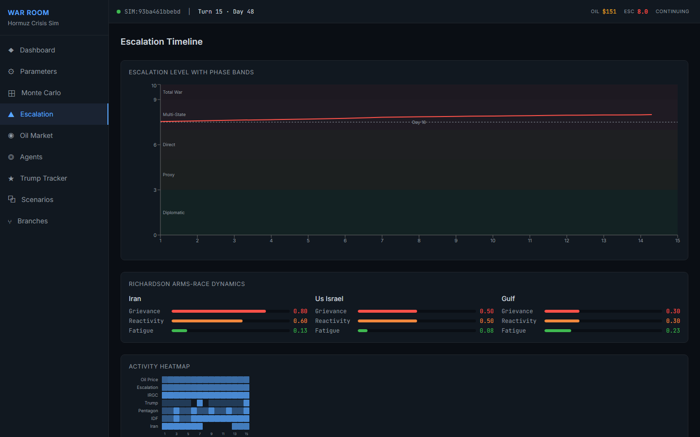
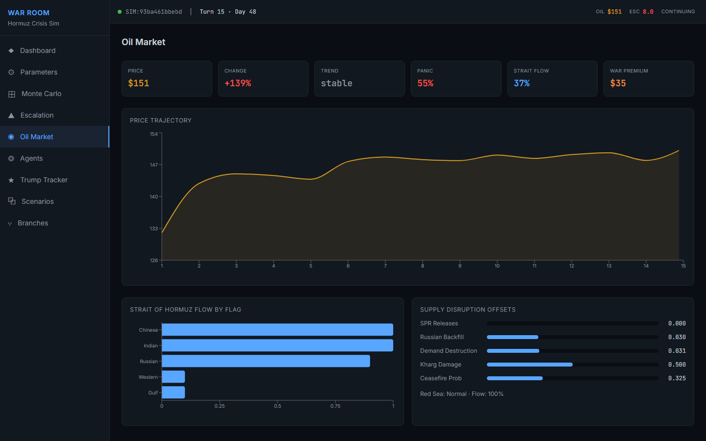
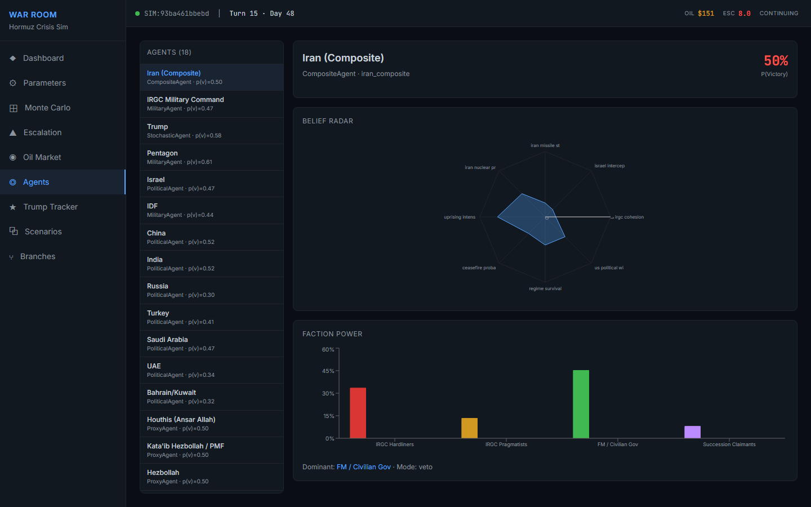
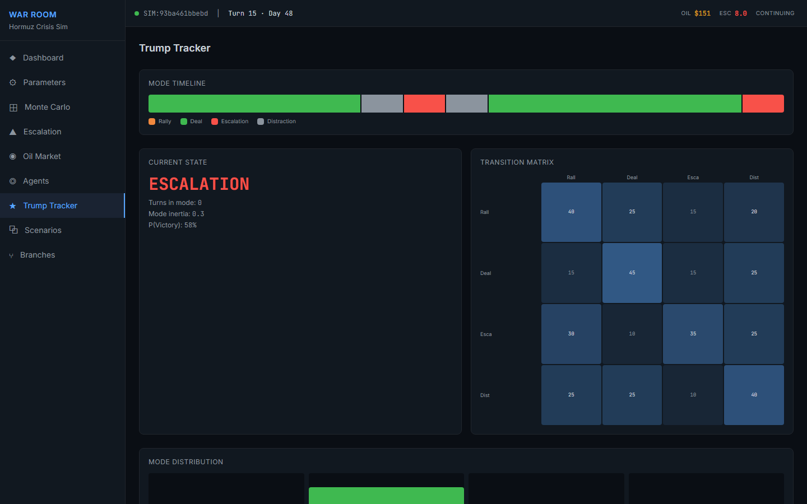
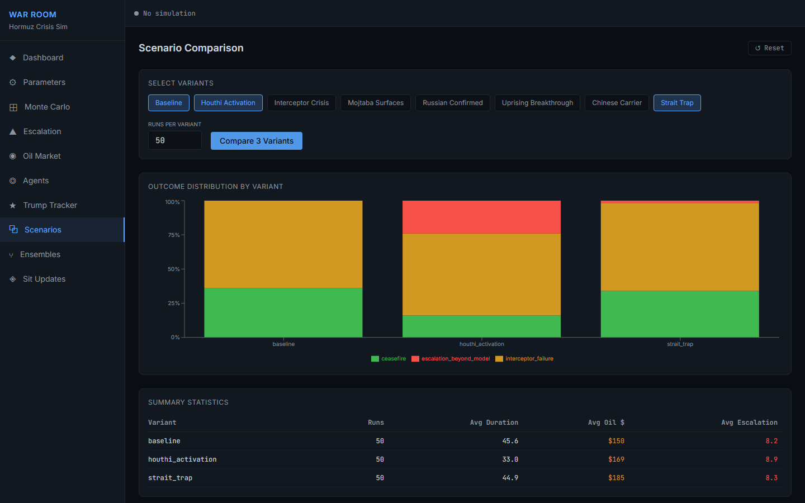
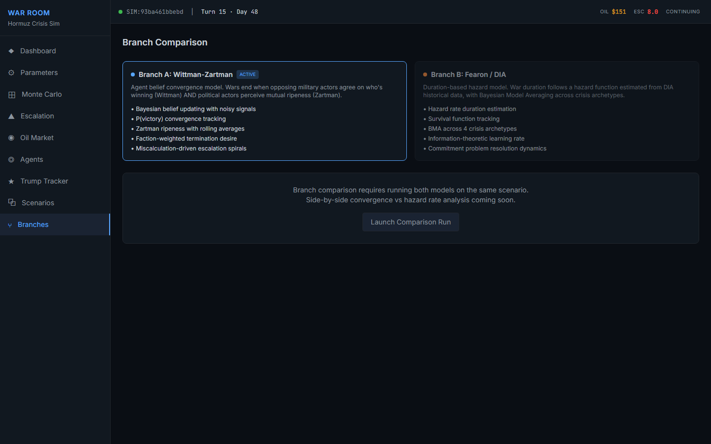

# Hormuz Crisis Simulation

Multi-agent geopolitical simulation of a Strait of Hormuz crisis scenario (Operation Epic Fury), modeled from Day 18 of hostilities. Built with two independent analytical branches for conflict termination, enabling comparative analysis of theoretical frameworks.

## Scenario

An Israeli decapitation strike against Iran's Supreme Leader triggers a regional war involving 18 agents across military, political, proxy, and mediator roles. The simulation models:

- **18 BDI agents** with Bayesian belief updating over 22 key unknowns
- **Noisy signal environment** with 14 signal types, costly signaling, and per-agent information access
- **Nonlinear oil market** with selective Strait blockade, panic multipliers, and insurance collapse
- **Emergent escalation** via Richardson arms race dynamics and miscalculation pressure
- **Stochastic Trump** (4-mode Markov chain: RALLY, DEAL, ESCALATION, DISTRACTION)
- **Composite Iran** with 4 factional power bases and veto dynamics
- **8 scenario variants** across 800 Monte Carlo runs per branch

## Situation Updates — Real-World Anchoring

The simulation doesn't run in a vacuum. The Situation Updates system continuously ingests real-world intelligence to keep the simulation's starting conditions calibrated to what is actually happening in the Iran-Israel crisis.

### How It Works

1. **OSINT Scraping** — Click "Scrape OSINT / News" to crawl multiple open-source intelligence feeds:
   - [iranmonitor.org](https://www.iranmonitor.org) — dedicated Iran crisis tracker
   - News API — wire services and major outlets
   - X / Twitter — real-time social signals
   - Polymarket — prediction market odds on conflict outcomes
   - AirNav Radar — military aviation activity
   - MarineTraffic — strait shipping and naval movements
   - GeoConfirmed — geolocated conflict events

2. **Claude API Analysis** — Scraped events are sent to Claude (Sonnet) with the full parameter table and current baseline values. Claude returns structured parameter adjustments — for example, a confirmed Iranian missile test might yield `ground_truth.iran_missile_stocks += 0.05` with reasoning. Oil price references from Brent crude are extracted as absolute values.

3. **Human-in-the-Loop Review** — Each update arrives as "pending" with its proposed parameter changes and source text visible. An analyst approves or rejects each update before it affects the baseline. This prevents hallucinated or misinterpreted intelligence from corrupting the simulation.

4. **Cumulative Baseline Computation** — Approved updates accumulate chronologically. The baseline for any given date is computed as: Day 18 defaults + all approved deltas up to that date, clamped to valid parameter ranges. This means the simulation's starting conditions evolve daily as new intelligence is collected and approved.

5. **Named Baseline Snapshots** — Save the current computed baseline as a named snapshot (e.g., "March 17 baseline"). Snapshots capture the full parameter state at a point in time and can be loaded from the Dashboard when creating a new simulation. This enables A/B comparison: run Monte Carlo against last week's baseline vs. today's.

6. **Historical Replay** — Every date with collected data becomes a selectable starting point. Choose "March 12" and the simulation initializes with the baseline as it existed on that date — the oil price, escalation level, interceptor stocks, and all other parameters reflect what was known at that time.

### Date Anchoring

The simulation is anchored to the real calendar. The war started on February 25, 2026 (Day 1). The dashboard header shows both the simulation turn and the corresponding calendar date ("Day 20 of war — Mar 17, 2026"). Each turn advances 2 days. Starting a simulation from a historical date automatically computes the correct war day offset.

### Architecture

The pipeline is fully self-contained:
- **Scraper** (`api/services/scraper.py`) — httpx + BeautifulSoup, extracts from Next.js `__NEXT_DATA__` or falls back to HTML parsing, content-hashes for deduplication
- **Analyzer** (`api/services/analyzer.py`) — anthropic SDK, structured JSON output, validates against known parameter names
- **Update Store** (`api/services/update_store.py`) — JSON log at `data/updates/log.json`, thread-safe, cumulative baseline computation
- **Snapshot Store** (`api/services/snapshot_store.py`) — JSON persistence at `data/snapshots/snapshots.json`

Set `HORMUZ_ANTHROPIC_API_KEY` in your environment (or `.env`) to enable the Claude analysis pipeline.

## Two Analytical Branches

### Wittman-Zartman (`src/`)

Termination emerges endogenously from agent dynamics:
- **Wittman convergence**: military actors' p(victory) estimates converge, making continued fighting irrational
- **Zartman ripeness**: political actors perceive mutual hurting stalemate + a face-saving exit

Baseline results: 57% interceptor failure, 21% ceasefire, 15% escalation beyond model

### Fearon/DIA Ensemble (`src_fearon_dia/`)

Duration modeled directly via hazard rates:
- **Fearon bargaining**: information asymmetry decay, bargaining range, commitment problems
- **DIA empirical**: Weibull/LogNormal archetype mixture with Cox proportional hazards
- **BMA ensemble**: Bayesian Model Averaging with adaptive weights

Baseline results: 53% interceptor failure, 24% regime collapse, 13% ceasefire

Both branches share identical agents, beliefs, signals, oil market, and escalation mechanics. They differ only in how they determine when and why the war ends.

---

## War Room Dashboard

An interactive React dashboard for exploring simulations in real time.



### Features

**Dashboard** — Real-time KPI cards, oil/escalation sparklines, replay controls (play/pause/speed), and a narrative feed that translates simulation events into readable prose.

**Situation Updates** — Scrape OSINT and news sources (iranmonitor.org, News API, X/Twitter, Polymarket, AirNav Radar, MarineTraffic, GeoConfirmed) to update simulation baselines with real-world events. Claude API maps events to parameter adjustments. Save named baseline snapshots and replay from any historical date.

**Parameter Editor** — Sliders for 35+ ground truth variables (missile stocks, political will, nuclear progress, etc.) with live override tracking. Tweak Day 18 starting conditions and launch custom simulations.



**Monte Carlo Analysis** — Configure variant, run count, and max turns. Launch batch runs with outcome distribution charts, duration-vs-oil scatter plots, and aggregate statistics.



**Escalation Timeline** — Escalation trajectory with color-coded phase bands (diplomatic, proxy, direct, multi-state war, total war), Richardson arms-race dynamics panel, and an activity heatmap showing agent intensity over time.



**Oil Market** — Price trajectory, strait flow breakdown by flag state, supply disruption metrics, panic level, and war risk premium tracking.



**Agent Explorer** — Browse all 18 agents with belief radar charts, faction power bars for Iran's composite agent, and type-specific details (military accumulated cost, political pain/ripeness, proxy autonomy).



**Trump Tracker** — Mode timeline (rally/deal/escalation/distraction), 4x4 transition matrix heatmap, current state display, and mode distribution across the simulation.



**Scenario Comparison** — Select multiple variants, launch parallel Monte Carlo runs, and compare outcome distributions side-by-side with grouped bar charts and summary statistics.



**Ensemble Model Comparison** — Run both termination models (Wittman-Zartman belief convergence vs Fearon/DIA hazard rate) side-by-side on the same scenario variant. Compares oil price trajectories, escalation curves, and terminal outcomes across the two analytical frameworks.



### Running the Dashboard

#### Live App

<!-- TODO: Add Vercel deployment URL -->
Coming soon at **[hormuz-sim.vercel.app](#)**

#### Local Hosting

Two terminals:

```bash
# Terminal 1 — API server
pip install fastapi uvicorn[standard] pydantic-settings websockets httpx beautifulsoup4 anthropic
python -m uvicorn api.main:app --port 8000

# Terminal 2 — React frontend
cd web
npm install --legacy-peer-deps
npm run dev
```

Open **http://localhost:5173** — click "Create Baseline Simulation" and use Step/Play/Run to explore.

**Docker alternative:**
```bash
docker-compose up
# Open http://localhost:3000
```

### Dashboard Tech Stack

- **Frontend**: React 19 + TypeScript + Vite 8 + Tailwind CSS v4 + Zustand + Recharts
- **Backend**: FastAPI + Pydantic v2 + uvicorn + WebSockets
- **OSINT Pipeline**: httpx + BeautifulSoup + Claude API (anthropic SDK)
- **Theme**: Dark "war room" aesthetic — near-black blues, monospace numbers, amber/red/green semantic colors

---

## CLI Usage

```bash
# Wittman-Zartman branch
python run.py                              # Single baseline run
python run.py --monte-carlo 100            # 100 Monte Carlo runs
python run.py --compare                    # Compare all 8 variants
python run.py --variant houthi_activation --seed 42

# Fearon/DIA branch
python run_fearon_dia.py                   # Single baseline run
python run_fearon_dia.py --monte-carlo 100
python run_fearon_dia.py --compare
python run_fearon_dia.py --ensemble regime_switching
```

Options: `--variant`, `--monte-carlo N`, `--compare`, `--turns`, `--seed`, `--csv`, `--quiet`

Fearon/DIA also supports: `--ensemble {bma, fearon_prior, regime_switching}`

## Scenario Variants

| Variant | Description |
|---|---|
| `baseline` | Day 18 status quo |
| `houthi_activation` | Houthis activate Red Sea attacks (most destabilizing) |
| `interceptor_crisis` | Israel starts at 8% interceptor stocks |
| `mojtaba_surfaces` | Khamenei successor emerges publicly |
| `russian_confirmed` | Russia confirmed supplying Iran |
| `uprising_breakthrough` | Major city uprising overwhelms IRGC |
| `chinese_carrier` | China willing to guarantee ceasefire |
| `strait_trap` | Iran activates selective strait blockade |

## Documents

Located in [`docs/first run results/`](docs/first%20run%20results/):

| File | Description |
|---|---|
| `SCENARIO_DOCUMENT.pdf` | Complete scenario definition (1240 lines) |
| `FINDINGS_WITTMAN_ZARTMAN.pdf` | Wittman-Zartman branch findings with math appendix |
| `FINDINGS_FEARON_DIA.pdf` | Fearon/DIA branch findings with math appendix |
| `COMPARATIVE_ANALYSIS.pdf` | White paper comparing both analytical approaches |

## Project Structure

```
hormuz-sim-dashboard/
  api/                          # FastAPI backend
    main.py                     #   App creation, CORS, lifespan
    config.py                   #   pydantic-settings
    schemas.py                  #   Pydantic request/response models
    routers/                    #   REST endpoints
      simulation.py             #     Sim CRUD (create/step/run/state/agents)
      parameters.py             #     Ground truth, oil, escalation param defaults
      monte_carlo.py            #     MC launch, status, results
      scenarios.py              #     8 built-in variants + custom CRUD
      comparison.py             #     Multi-variant MC comparison
      export.py                 #     CSV export
      updates.py                #     Situation updates + OSINT crawl
      snapshots.py              #     Named baseline snapshots
    services/
      sim_manager.py            #     Manages sim instances
      mc_runner.py              #     Async MC with ThreadPoolExecutor
      update_store.py           #     Situation update log + baseline computation
      snapshot_store.py         #     Named baseline snapshot CRUD
      scraper.py                #     iranmonitor.org + news scraping
      analyzer.py               #     Claude API event-to-parameter mapping
    ws/
      handlers.py               #     WebSocket MC streaming + live sim
  web/                          # React frontend (Vite + TypeScript)
    src/
      api/                      #   API client + WebSocket
      stores/                   #   Zustand state (simulation, monteCarlo, params, updates, ui)
      types/                    #   TypeScript interfaces
      pages/                    #   10 page components
      components/               #   ReplayControls, NarrativeFeed, SensitivityMatrix, etc.
  src/                          # Wittman-Zartman branch
    beliefs.py                  #   Bayesian belief system (Beta/Gaussian)
    signals.py                  #   Signal taxonomy and information environment
    agents.py                   #   18 BDI agents (Military, Political, Stochastic, Composite, Proxy)
    escalation.py               #   Richardson dynamics + miscalculation pressure
    termination.py              #   Wittman convergence + Zartman ripeness
    oil_market.py               #   Nonlinear oil market with selective blockade
    scenario.py                 #   Agent instantiation with Day 18 calibration
    simulation.py               #   9-step turn loop + ground truth
    monte_carlo.py              #   Monte Carlo runner
  src_fearon_dia/               # Fearon/DIA branch
    covariates.py               #   Covariate extraction from sim state
    fearon.py                   #   Rationalist bargaining model
    dia_hazard.py               #   Empirical hazard-rate model (3 archetypes)
    ensemble.py                 #   BMA / Fearon-prior / regime-switching
    duration_termination.py     #   Drop-in termination replacement
    simulation_b.py             #   Simulation wrapper (swaps termination only)
    monte_carlo_b.py            #   MC runner with duration analytics
  docs/first run results/       # First-run analytic outputs
  run.py                        # CLI entry point (Wittman-Zartman)
  run_fearon_dia.py             # CLI entry point (Fearon/DIA)
  docker-compose.yml            # Docker deployment
```

## Requirements

**Simulation (CLI):** Python 3.10+ (standard library only, no external dependencies)

**Dashboard:** Python 3.10+ with `fastapi`, `uvicorn`, `pydantic-settings`, `websockets`, `httpx`, `beautifulsoup4`, `anthropic` | Node.js 18+ for the React frontend
